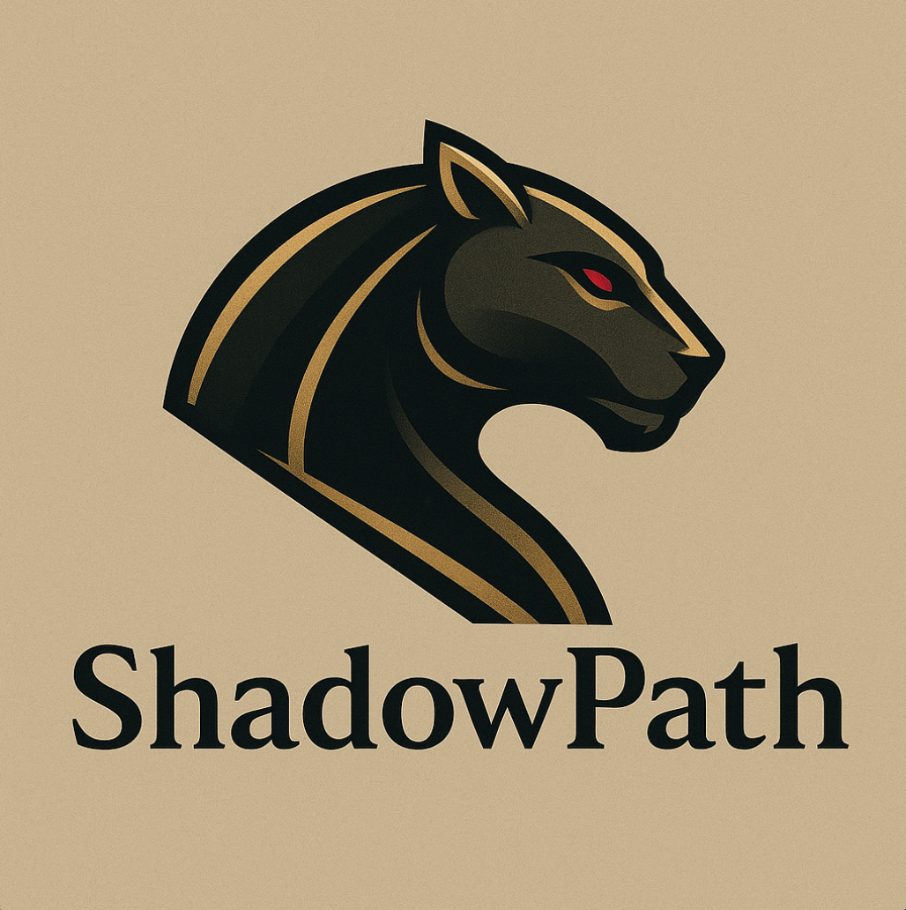

# ShadowPath v1.0.0

 
 
 

## 🧭 About
> Ultra-fast backend for Ethereum gas and swap estimation — off-chain math, on-chain accuracy.

---

## 🏷️ Project Overview

**ShadowPath** is a lightweight **Nest.js backend service** designed to deliver critical Ethereum network data with **ultra-low latency** and **off-chain precision**.  
It exposes two main endpoints:

- **`/gasPrice`** — Returns the latest Ethereum gas price with response times under **50 ms**, optimized through smart caching and parallel queries.  
- **`/return/:fromTokenAddress/:toTokenAddress/:amountIn`** — Estimates token swap outputs on **Uniswap V2**, implementing the AMM math entirely off-chain using liquidity data from Ethereum nodes.

---

## 💡 The Problem It Solves

Accessing accurate and fast blockchain data is often **expensive, slow, or limited** by on-chain execution times.  
Developers and DeFi services face:

- Delays caused by RPC congestion or contract calls.  
- High gas costs for simple read operations.  
- Inconsistent performance from public APIs.  

**ShadowPath** solves this by:

- Performing **mathematical swap calculations off-chain**.  
- Fetching **state metadata (balances)** from trusted node providers like **Infura**, **Alchemy**, or **QuickNode**.  
- Delivering **real-time, precise results** in milliseconds — without touching on-chain functions.

---

## ⚙️ Tech Stack

- **Nest.js** – modular, scalable backend framework  
- **Ethers.js / Web3.js** – blockchain communication  
- **Uniswap V2 Factory** – core liquidity reference  
- **RPC Providers:** Infura, Alchemy, QuickNode  

---

## 🚀 Philosophy

ShadowPath embodies **silent efficiency** — complex DeFi data resolved with clarity, speed, and precision.  
It’s built for developers who value **technical elegance**, **low latency**, and **open infrastructure design**.

---

## 📄 License

This project is licensed under the **GNU General Public License v3.0 (GPL-3.0)**.  
No commercial or private use is allowed without explicit permission.
